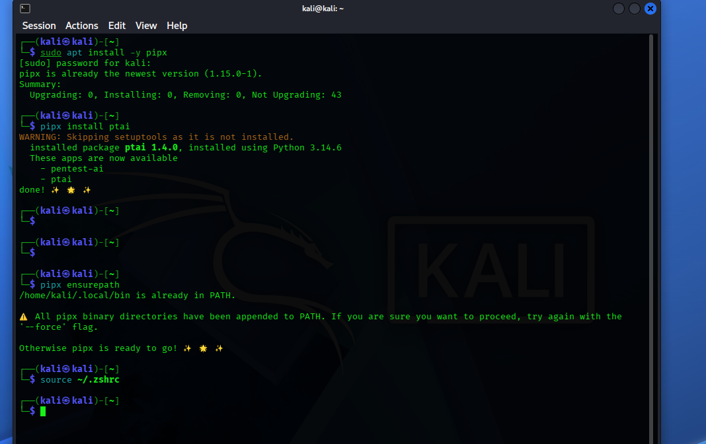
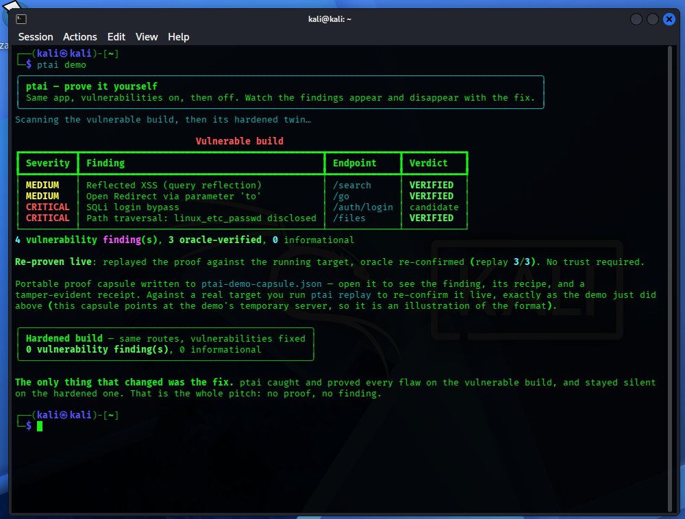
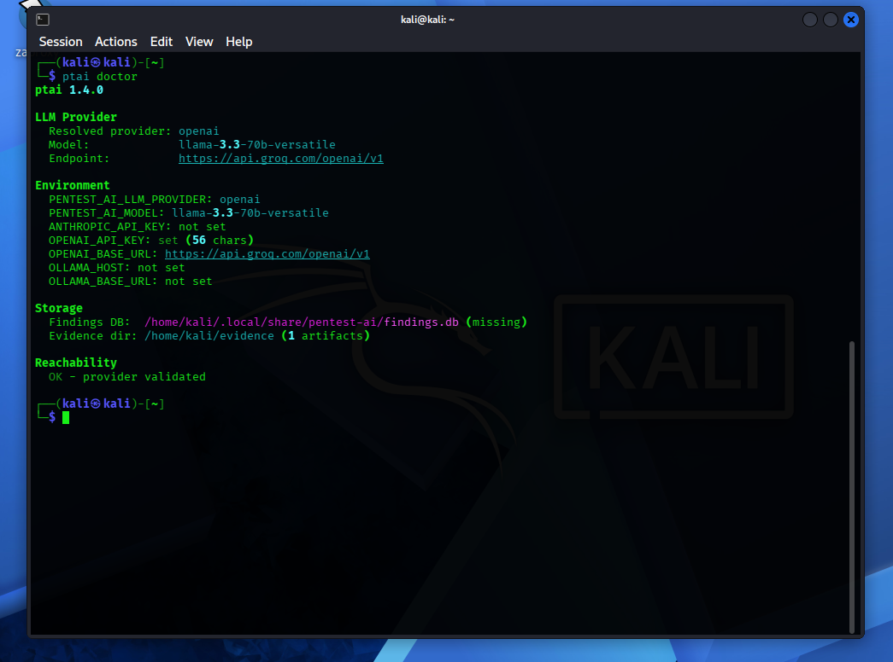
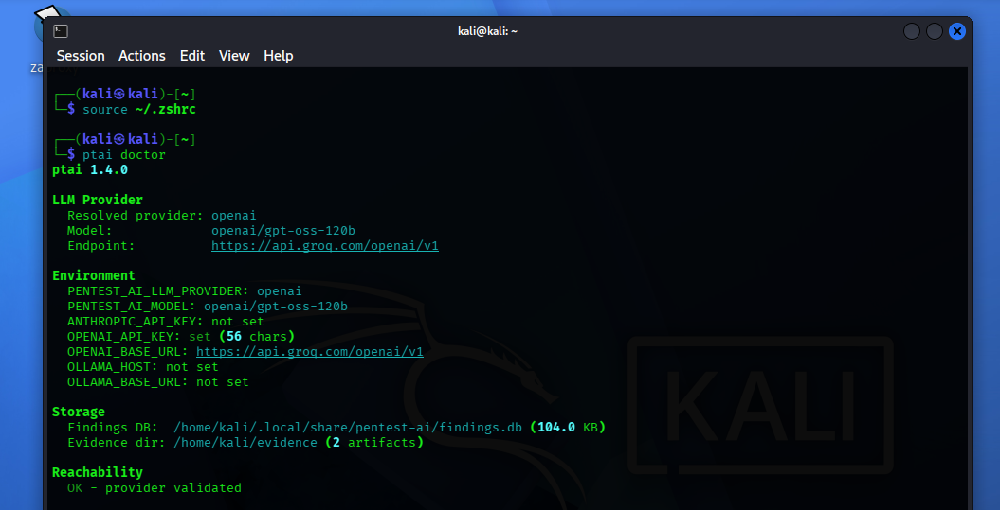
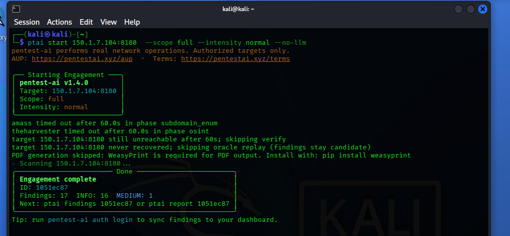
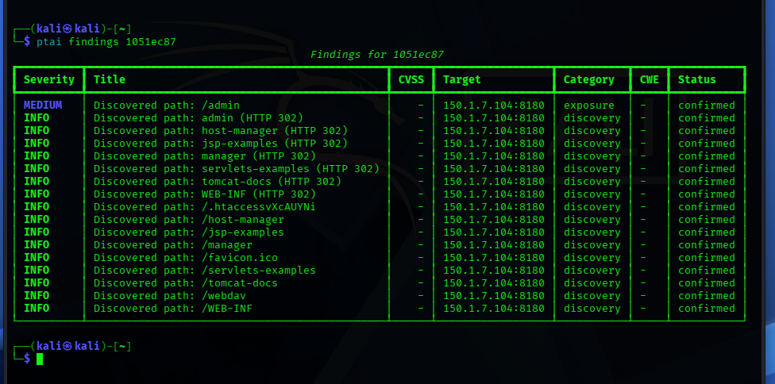

# pentest-ai (ptai) — Deployment, Migration & Findings

Deployed [pentest-ai](https://github.com/0xSteph/pentest-ai) (ptai) — an
open-source, offense-only AI pentesting CLI (205+ tools, 17 specialist
agents, self-verifying findings) — on Kali Linux, configured with a
Groq-hosted LLM backend, and ran authorized scans against a self-hosted lab
target. Documented below with full command output, a mid-project LLM
provider migration, and real findings against my own lab environment.

**pentest-ai itself is third-party, MIT-licensed software by
[0xSteph](https://github.com/0xSteph).** This repo documents my own
deployment, configuration, troubleshooting, and scan results — not a claim
of authorship over the tool.

## Stack

- Kali Linux (VMware)
- LLM backend: Groq API, OpenAI-compatible endpoint
- Lab target: self-hosted Metasploitable2, isolated host-only VMware network
- Authorization: explicit self-owned lab environment, per ptai's AUP

## Walkthrough

### 1. Install
```bash
sudo apt install -y pipx
pipx install ptai
pipx ensurepath
source ~/.zshrc
```


### 2. Validate with the built-in proof-of-concept demo
```bash
ptai demo
```
4 findings on the vulnerable build (reflected XSS, open redirect, SQLi
login bypass, path traversal), 3 oracle-verified, replay-confirmed against
the live target, 0 findings on the hardened twin.



### 3. Configure the Groq LLM backend
```bash
export OPENAI_API_KEY=your_groq_key
export OPENAI_BASE_URL=https://api.groq.com/openai/v1
export PENTEST_AI_LLM_PROVIDER=openai
ptai doctor
```
Initially resolved to `llama-3.3-70b-versatile`, provider validated.



### 4. Mid-project model deprecation — migrated backend
Groq deprecated `llama-3.3-70b-versatile` (announced Jun 17 2026,
decommissioned Aug 16 2026) partway through this project — live scans
started failing with `model_not_found` (HTTP 404). Migrated to Groq's
official recommended replacement:
```bash
sed -i 's/llama-3.3-70b-versatile/openai\/gpt-oss-120b/' ~/.zshrc
source ~/.zshrc
ptai doctor
```
Re-validated clean: `Resolved provider: openai`, `Model: openai/gpt-oss-120b`,
`Reachability: OK - provider validated`.



### 5. Real scan against a self-hosted Metasploitable2 lab target
```bash
ptai start 150.1.7.104:8180 --scope full --intensity normal --no-llm
```
Ran in deterministic (`--no-llm`) mode after `gpt-oss-120b` hit Groq's
free-tier rate limit (8000 TPM) mid-agent-loop on live-target scans.
17 findings: 16 INFO, 1 MEDIUM.



### 6. Findings
```bash
ptai findings 1051ec87
```
All 17 findings `confirmed`. The MEDIUM finding (`/admin` exposure) flags
Tomcat's Manager/Host-Manager interfaces reachable on the target — on
Metasploitable2 these commonly run default credentials (`tomcat`/`tomcat`),
a known escalation path to full WAR-deployment RCE. Manual credential
verification is the natural next step to escalate this from discovery-tier
to a confirmed auth bypass.



## Issues hit and resolved

- **Groq model deprecation mid-project** — `llama-3.3-70b-versatile`
  stopped resolving; migrated to `openai/gpt-oss-120b` and re-validated.
- **Free-tier rate limiting** — `gpt-oss-120b` hit Groq's 8000 TPM cap a
  few iterations into the LLM-driven agent loop against a live target;
  switched to `--no-llm` for the deterministic orchestrator pipeline.
- **`InvalidUrlClientError` on bare IP / scheme-only URL** — ptai's
  HTTP-layer scanning needed an explicit `IP:PORT` target
  (`150.1.7.104:8180`), not a bare IP or `http://IP`.
- **`amass`/`theharvester` timing out regardless of `--scope`** — these
  domain-enumeration tools ran (and hit their 60s timeout) even under
  `--scope web`/`--scope full`, which shouldn't need subdomain/OSINT
  modules for an internal IP target with no DNS name — looks like a
  scope-gating bug in ptai itself.

**Authorized testing only.** Every scan here ran against infrastructure I
own and control (a self-hosted Metasploitable2 VM on an isolated network).
